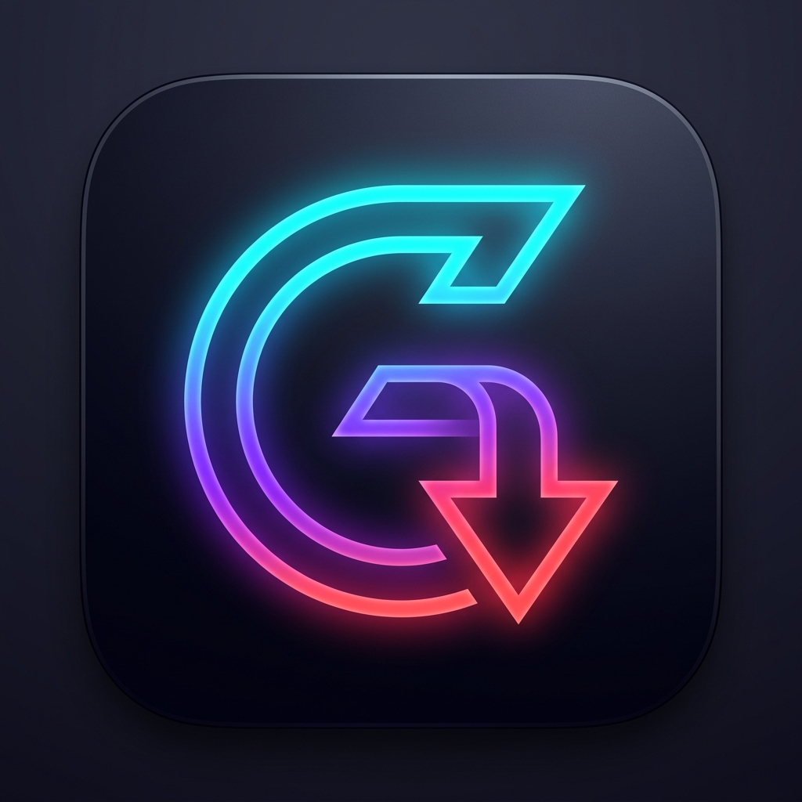
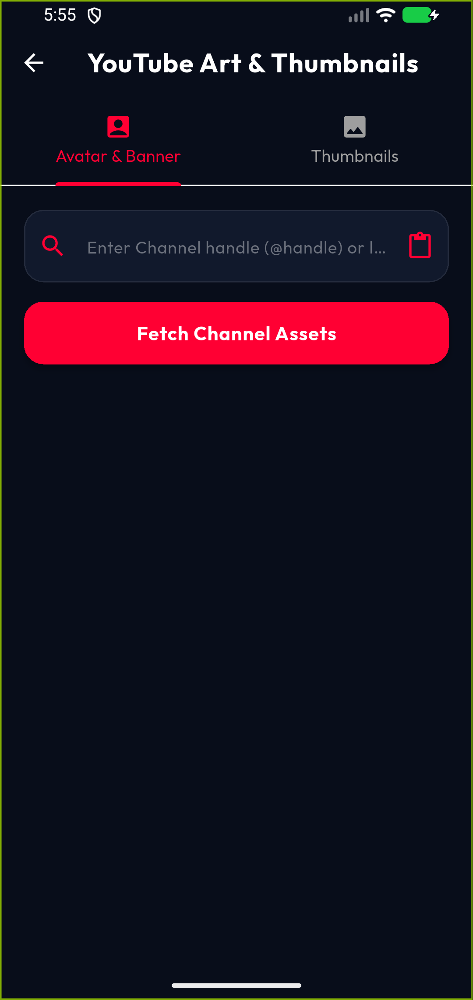

# Grabbery

**Media downloader for Android**

Download videos, audio, thumbnails, and profiles from YouTube, Instagram, TikTok, and Facebook.

[**Download APK**](https://github.com/Md-Saim/Grabbery---Social-Media-videos-downloader/releases/latest/download/Grabbery-v1.0.0-release.apk) · [Releases](https://github.com/Md-Saim/Grabbery---Social-Media-videos-downloader/releases)

---

## Features

- **YouTube**
  - Videos up to 4K + MP3 audio
  - Public playlists
  - Video thumbnails
  - Channel profile picture & banner

- **Instagram**
  - Reels, video posts, and photo carousels
  - Caption copy tool

- **TikTok**
  - Videos without watermark
  - Audio extraction
  - Caption copy tool

- **Facebook**
  - Public videos and reels
  - Video thumbnails
  - Profile picture & banner
  - Caption copy tool

- Concurrent downloads with pause / resume / cancel
- Profile downloader
- Saves directly to device gallery (`Download/Grabbery`)

---

## Screenshots

<table>
<tr>
<td align="center"><b>Home</b> </td>
<td align="center"><b>Drawer</b> </td>
<td align="center"><b>Playlist</b> </td>
<td align="center"><b>Tools</b> </td>
</tr>
</table>

---

## Tech Stack

| Component            | Technology                          |
|----------------------|-------------------------------------|
| Framework            | Flutter                             |
| Language             | Dart                                |
| Networking           | Dio + HTTP Range requests           |
| State Management     | Provider                            |
| Storage & Gallery    | Android MediaStore + MediaScanner   |
| UI                   | Material 3                          |

---

## Installation

1. Download the APK from the [Releases](https://github.com/Md-Saim/Grabbery---Social-Media-videos-downloader/releases/latest) page
2. Allow installation from unknown sources
3. Install the app
4. Grant storage permission when asked

---

## Supported Platforms

| Platform    | Formats                          | Max Quality     | Audio | Thumbnails / Profile | Caption Copy |
|-------------|----------------------------------|-----------------|-------|----------------------|--------------|
| YouTube     | Videos, Shorts, Playlists        | Up to 4K        | Yes   | Yes                  | —            |
| Instagram   | Reels, Posts, Carousels          | 1080p           | Yes   | —                    | Yes          |
| TikTok      | Videos (no watermark)            | HD              | Yes   | —                    | Yes          |
| Facebook    | Videos, Reels                    | HD / SD         | Yes   | Yes                  | Yes          |

---

## Developer

**Moiz Ud Din Saim**  
[GitHub](https://github.com/Md-Saim)

---

## License

Proprietary. All rights reserved © 2026 Moiz Ud Din Saim.

---

## Disclaimer

For personal use only. Users are responsible for following the terms of service of each platform and applicable copyright laws.
