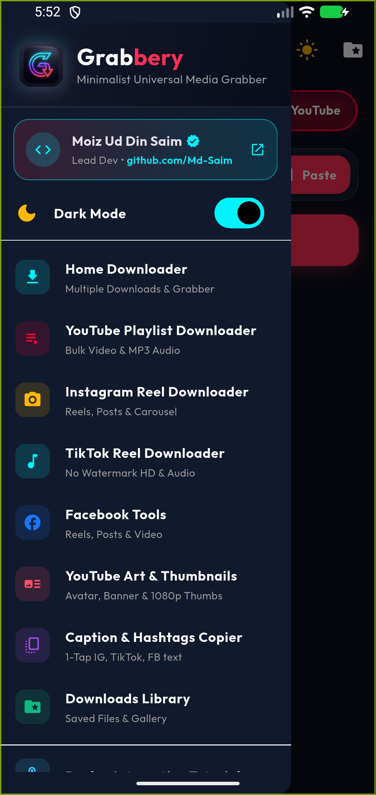

# Grabbery

A simple and fast media downloader for Android.

Download videos and audio from YouTube, Instagram, TikTok, and Facebook.

## Download

[Download Latest APK](https://github.com/Md-Saim/Grabbery---Social-Media-videos-downloader/releases/latest)

**Requirements:** Android 8.0+

## Features

- YouTube videos (up to 4K) and MP3 audio
- YouTube public playlists
- Instagram Reels and posts
- TikTok videos (no watermark)
- Facebook videos
- Concurrent downloads with progress
- Saves directly to gallery

## Screenshots

| Home | Playlist | Downloads |
|------|----------|-----------|
|  |  |  |

## How to Install

1. Download the APK from the link above
2. Allow installation from unknown sources
3. Install and grant storage permission

## Built With

- Flutter
- Dart

## Developer

**Moiz Ud Din Saim**  
[GitHub](https://github.com/Md-Saim)

## License

Proprietary. All rights reserved © 2026 Moiz Ud Din Saim.

## Disclaimer

This app is for personal use only. Users are responsible for complying with the terms of service of the platforms and copyright laws.
